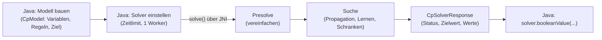

# CP-SAT Stundenplan-Demo (Google OR-Tools, Java)

Ein bewusst **kleines** Lern- und Demo-Projekt: Ein Mini-Stundenplan, der mit dem **CP-SAT-Solver** aus
[Google OR-Tools](https://developers.google.com/optimization/cp/cp_solver?hl=de) berechnet wird – **lokal** auf dem
eigenen Rechner, ohne Cloud.

Das Beispiel bildet nach, wie an der Uni heute ein Stundenplan entsteht: Die Professorinnen und Professoren
**reichen ihre Zeiten ein**, es steht fest, **wer welches Modul anbietet**, welche **Studiengruppen** es gibt und
**wie groß** sie sind, und es gibt **große und kleine Räume**. Daraus berechnet CP-SAT **einen gemeinsamen
Stundenplan** für zwei Studiengruppen: Informatik (INF, groß) und Wirtschaftsinformatik (WINF, klein).

Ziel ist nicht der perfekte Planer, sondern zu **verstehen**, wie CP-SAT arbeitet: Wie bekommt das Modell seine
Eingabe? Wie schreibt man Regeln? Wie kommt der Plan wieder heraus? Jede Regel ist im Code **auf Deutsch erklärt**
(*Fachlich, So geht's, Geeignet für, Achtung*). Wer den Code in der Reihenfolge aus
[Kapitel 5](#5-projektstruktur-und-programmablauf) liest, kann danach selbst CP-SAT-Modelle bauen.

---

## Inhalt

1. [Was ist CP-SAT?](#1-was-ist-cp-sat)
2. [Wie rechnet CP-SAT? (Blick unter die Haube)](#2-wie-rechnet-cp-sat-blick-unter-die-haube)
3. [Voraussetzungen, Build und Start](#3-voraussetzungen-build-und-start)
4. [Das Szenario: die Eingabedaten](#4-das-szenario-die-eingabedaten)
5. [Projektstruktur und Programmablauf](#5-projektstruktur-und-programmablauf)
6. [Die Variablen](#6-die-variablen)
7. [Die Regeln (Constraints)](#7-die-regeln-constraints)
8. [Das Ziel](#8-das-ziel)
9. [Solver starten und Ergebnis auswerten](#9-solver-starten-und-ergebnis-auswerten)
10. [Zum Ausprobieren](#10-zum-ausprobieren)
11. [Erkenntnisse und Stolperfallen](#11-erkenntnisse-und-stolperfallen)
12. [Vom Demo zum echten Stundenplaner](#12-vom-demo-zum-echten-stundenplaner)

---

## 1. Was ist CP-SAT?

- **CP-SAT** ist der Constraint-Programming-Solver von Google OR-Tools (Open Source, Apache-2.0-Lizenz, in C++
  geschrieben, mit Schnittstellen für Java, Python, C# und C++). Er hat mehrfach Goldmedaillen bei der
  *MiniZinc Challenge* gewonnen, dem jährlichen Wettbewerb der Constraint-Solver.
- Man programmiert **deklarativ**: Man beschreibt, *was* gelten soll (Variablen + Regeln + optional ein Ziel) –
  *wie* eine Lösung gefunden wird, entscheidet der Solver.
- Variablen und Regeln kennen **nur ganze Zahlen** (`long`) und Ja/Nein-Werte. Kommazahlen muss man skalieren
  (z. B. Euro → Cent). Dieses Demo kommt mit Ja/Nein-Variablen aus.
- Typische Einsatzgebiete: Stundenpläne, Schichtpläne, Maschinenbelegung (Scheduling), Zuordnungsprobleme,
  Tourenplanung, Packprobleme.

### Die Begriffe

| Begriff | Bedeutung | In diesem Projekt |
|---|---|---|
| **Modell** (`CpModel`) | Die Beschreibung des Problems: Variablen, Regeln, Ziel. Beim Bauen wird noch nichts gerechnet. | `StundenplanModell` baut es aus den Eingabedaten. |
| **Variable** | Eine offene Entscheidung mit einem Wertebereich. Den Wert legt der Solver fest. | 180 Ja/Nein-Variablen: „Findet Modul m im Zeitslot z im Raum r statt?“ |
| **Regel** (Constraint) | Eine Bedingung, die **jede** Lösung erfüllen muss (hart). | 8 fachliche Regeln, zusammen 277 Constraints |
| **Ziel** (optional) | Was unter allen gültigen Lösungen möglichst klein (`minimize`) oder groß (`maximize`) sein soll. | Möglichst wenige leere Plätze |
| **Solver** (`CpSolver`) | Rechnet: sucht Werte für alle Variablen, die alle Regeln erfüllen, und darunter die beste Lösung. | Ein Aufruf: `solver.solve(modell)` |
| **Status** | Die Antwort des Solvers: Gibt es eine Lösung? Ist sie bewiesen die beste? | `OPTIMAL`, Zielwert 170 |

### Lokal statt Cloud

Dieses Projekt rechnet **vollständig lokal**:

- Die Maven-Abhängigkeit `com.google.ortools:ortools-java` ist ein dünner Java-Wrapper (JNI). Die eigentliche
  C++-Bibliothek steckt als native Datei in plattformspezifischen JARs (z. B. `ortools-win32-x86-64`,
  `ortools-linux-x86-64`, `ortools-darwin-aarch64`), die Maven automatisch mitlädt.
- `Loader.loadNativeLibraries()` entpackt die passende Bibliothek in ein temporäres Verzeichnis und lädt sie in die
  JVM. Danach läuft alles im eigenen Prozess – **keine Netzwerkverbindung, kein Google-Konto, keine Lizenzkosten**.
- Google bietet zusätzlich Optimierung als Cloud-Dienst an; das wird hier bewusst **nicht** verwendet.

---

## 2. Wie rechnet CP-SAT? (Blick unter die Haube)



1. **Modell bauen** – Die Java-Objekte (`BoolVar`, `Constraint`, …) sind nur Bausteine eines Protobuf-Objekts
   (`CpModelProto`). Beim Bauen wird noch **nichts** gerechnet. Erst `solver.solve(modell)` übergibt das Modell
   an den nativen Solver – im selben Prozess, ohne Netzwerk.
2. **Presolve** – Der Solver vereinfacht das Modell vor der Suche: Er setzt feste Werte ein, streicht unmögliche
   Werte und entfernt überflüssige Regeln. Hier fallen dabei schon die 117 Variablen weg, die Regel 2 oder 3 auf 0
   festnageln (siehe [Kapitel 6](#6-die-variablen)).
3. **Suche** – Mehrere Techniken arbeiten zusammen:
   - **Propagation** (Constraint Programming): Jede Regel streicht sofort, was nicht mehr geht. Beispiel: Setzt
     der Solver „Programmierung 1 | Di 10-12 | Hörsaal“ auf 1, dann folgt daraus:
     - Regel 4 (Raum): Alle anderen Variablen für den Hörsaal um Di 10-12 werden 0.
     - Regel 5 (Professor): Alle anderen Variablen von Prof. Müller um Di 10-12 werden 0.
     - Regel 7 (einmal pro Tag): Alle anderen Variablen „Programmierung 1 | Di …“ werden 0.
   - **SAT mit Klausel-Lernen** (CDCL): Läuft die Suche in einen Widerspruch, „lernt“ der Solver eine neue
     Klausel, die erklärt, warum – und macht denselben Fehler nie wieder. Das Demo-Modell besteht nur aus
     Ja/Nein-Variablen, also genau dem, wofür SAT-Techniken gebaut sind. (Auch ganzzahlige Variablen stellt CP-SAT
     intern durch Ja/Nein-Aussagen wie `[x ≤ 5]` dar.)
   - **LP-Relaxation**: Für die linearen Teile löst der Solver eine gelockerte Version des Problems, in der
     Variablen auch Werte zwischen 0 und 1 annehmen dürfen. Das liefert eine **Schranke**: Besser als dieser Wert
     kann kein Plan sein (`bestObjectiveBound`). Im Demo ist sie leicht nachzurechnen: INF passt nur in den
     Hörsaal (5 × 30 leere Plätze), WINF bestenfalls in den Seminarraum (4 × 5) – also mindestens 170. Der
     gefundene Plan hat genau 170, also gibt es keinen besseren.
   - **Portfolio paralleler Worker**: Standardmäßig laufen so viele Such-Strategien parallel, wie Kerne vorhanden
     sind – z. B. klassische Baumsuche, kernbasierte Suche (verbessert die Schranke), *Large Neighborhood Search*
     (LNS: Teile einer guten Lösung festhalten und den Rest neu optimieren) und lokale Suche. Die Worker tauschen
     Lösungen, Schranken und gelernte Klauseln aus. Das Demo stellt bewusst **1 Worker** ein, damit bei jedem
     Start derselbe Plan herauskommt (siehe [Kapitel 9](#9-solver-starten-und-ergebnis-auswerten)).
4. **Ergebnis** – ein Status:

   | Status | Bedeutung | Im Demo |
   |---|---|---|
   | `OPTIMAL` | Lösung gefunden **und bewiesen**, dass es keine bessere gibt (ohne Ziel: irgendeine Lösung gefunden). | der Normalfall: Plan mit 170 leeren Plätzen |
   | `FEASIBLE` | Gültige Lösung gefunden, Optimalität aber (noch) nicht bewiesen – z. B. Zeitlimit erreicht. | kommt bei diesem kleinen Modell nicht vor |
   | `INFEASIBLE` | **Bewiesen**, dass es keine Lösung gibt – die Regeln widersprechen sich. | wenn Prof. Schmidt nur den Donnerstag einreicht ([Kapitel 10](#10-zum-ausprobieren)) |
   | `MODEL_INVALID` | Das Modell ist fehlerhaft (z. B. leerer Wertebereich). `modell.validate()` sagt, warum. | das Demo gibt dann `validate()` aus |
   | `UNKNOWN` | Abbruch (z. B. Zeitlimit), bevor eine Lösung oder ein Unlösbarkeits-Beweis gefunden wurde. | das Demo rät dann zu mehr Rechenzeit |

   Bei `FEASIBLE` zeigt der Abstand zwischen `objectiveValue()` und `bestObjectiveBound()` (*Gap*), wie weit die
   gefundene Lösung höchstens vom Optimum entfernt ist.

---

## 3. Voraussetzungen, Build und Start

| Was | Version / Hinweis |
|---|---|
| JDK | **21 oder neuer** – unter Windows aber ein **aktueller Build** (siehe [Windows: JVM-Absturz](#windows-jvm-absturz-in-solve)). Projekt-JDK in IntelliJ: `openjdk-26`. Der Code wird für Java 21 kompiliert. |
| OR-Tools | `com.google.ortools:ortools-java:9.15.6755` (siehe `pom.xml`) |
| Maven | mitgeliefert als Wrapper (`mvnw` / `mvnw.cmd`, Maven 3.9.9) – oder das in IntelliJ eingebaute Maven |

### In IntelliJ

1. Projekt öffnen – IntelliJ erkennt das Maven-Projekt (`pom.xml`) und lädt die Abhängigkeiten.
2. Oben rechts die vorbereitete Run-Konfiguration **„Stundenplan-Demo“** wählen und starten.

### Auf der Kommandozeile (PowerShell)

```powershell
# Wichtig unter Windows: ein JDK mit aktueller msvcp140.dll wählen (siehe unten)
$env:JAVA_HOME = "$env:USERPROFILE\.jdks\openjdk-26.0.2.1"

.\mvnw.cmd -q compile exec:java
```

Die Hauptklasse `de.uni.stundenplan.StundenplanDemo` ist in der `pom.xml` eingetragen (`exec.mainClass`).

### Windows: JVM-Absturz in `solve()`

**Symptom:** Die JVM stürzt beim ersten `solver.solve(...)` hart ab (`EXCEPTION_ACCESS_VIOLATION` in `msvcp140.dll`,
Datei `hs_err_pid*.log`). Das Laden der Bibliothek klappt noch.

**Ursache:** Viele JDKs bringen eine eigene `bin\msvcp140.dll` (C++-Laufzeit von Microsoft) mit. Ist diese älter als
Version **14.38**, passt sie nicht zur neueren C++-Laufzeit, mit der OR-Tools gebaut ist
([google/or-tools#4690](https://github.com/google/or-tools/issues/4690),
[microsoft/STL#4730](https://github.com/microsoft/STL/issues/4730)). Ein Neuinstallieren der VC++-Runtime im System
hilft **nicht**, weil die JVM ihre eigene DLL lädt. Linux und macOS sind nicht betroffen.

**Lösung:** Ein JDK mit `msvcp140.dll` ≥ 14.40 verwenden. (Laut den STL-Entwicklern genügt schon 14.38; auf diesem
Rechner geprüft: 14.40 und neuer laufen, 14.36 und älter stürzen ab, 14.38 und 14.39 wurden nicht getestet.) Prüfen:

```powershell
(Get-Item "$env:JAVA_HOME\bin\msvcp140.dll").VersionInfo.FileVersion
```

| JDK (auf diesem Rechner geprüft) | msvcp140.dll | Ergebnis |
|---|---|---|
| OpenJDK 25.0.2, 26.0.1, 26.0.2, 26.0.2.1 | 14.42 | ✅ läuft |
| Azul Zulu 21.0.7 | 14.40 | ✅ läuft |
| Azul Zulu 21.0.6 | 14.31 | ❌ Absturz |
| OpenJDK 23.0.x, 24.0.1 | 14.36 | ❌ Absturz |
| Android Studio JBR 25.0.3 (aktuell das System-`JAVA_HOME`!) | 14.29 | ❌ Absturz |

### Temporäre Dateien

`Loader.loadNativeLibraries()` entpackt bei **jedem** Programmstart ca. 71 MB DLLs nach `%TEMP%\ortools-java<zahl>`.
Unter Windows bleiben diese Ordner liegen, weil die DLLs beim Beenden noch geladen sind. Ab und zu aufräumen:

```powershell
Get-ChildItem $env:TEMP -Directory -Filter "ortools-java*" | Remove-Item -Recurse -Force -ErrorAction SilentlyContinue
```

### Firmen-Artifactory / VPN

Die persönlichen Maven-Settings (`%USERPROFILE%\.m2\settings.xml`) zeigen auf das Firmen-Artifactory, das nur mit
VPN erreichbar ist. **Mit VPN funktioniert alles wie gewohnt.** Ohne VPN kann man für den ersten Download eine
eigene Settings-Datei mit Maven Central als Mirror verwenden (die Mirror-ID entspricht der des Artifactorys,
damit IntelliJ die heruntergeladenen Dateien danach ebenfalls akzeptiert):

```xml
<!-- z. B. C:\temp\settings-central.xml -->
<settings>
  <mirrors>
    <mirror>
      <id>as-maven-all</id>
      <url>https://repo.maven.apache.org/maven2</url>
      <mirrorOf>*</mirrorOf>
    </mirror>
  </mirrors>
</settings>
```

```powershell
.\mvnw.cmd -s C:\temp\settings-central.xml -q compile exec:java
```

### JVM-Optionen (nur gegen Warnungen, nicht nötig für die Funktion)

| Option | Warum |
|---|---|
| `--enable-native-access=ALL-UNNAMED` | Ab JDK 24 warnt die JVM, wenn eine Bibliothek nativen Code lädt (hier: OR-Tools, [JEP 472](https://openjdk.org/jeps/472)). |
| `-Dsun.misc.unsafe.memory.access=allow` | Unterdrückt ab JDK 24 eine Warnung aus `protobuf-java`, das `sun.misc.Unsafe` nutzt. Auf älteren JDKs wird die Eigenschaft einfach ignoriert. |
| `-Dstdout.encoding=UTF-8` | Nur in der IntelliJ-Run-Konfiguration: Umlaute in der IntelliJ-Konsole. |

Die ersten beiden stehen in `.mvn/jvm.config` (für `mvnw exec:java`) und in der IntelliJ-Run-Konfiguration
(`.idea/runConfigurations/Stundenplan_Demo.xml`).

---

## 4. Das Szenario: die Eingabedaten

Die Eingabedaten stehen in `daten/Eingabedaten.java` (Methode `beispiel()`): ganz normale Java-Records, ohne
Solver-Logik. Im echten Projekt kämen sie aus einer Datenbank oder einem Formular – an den Regeln würde das nichts
ändern.

| Was | Im Beispiel |
|---|---|
| **Zeitraster** | Mo–Fr mit je 3 Zeitslots (08-10, 10-12, 14-16) = **15 Zeitslots** pro Woche |
| **Studiengruppen** | **INF** Informatik: 90 Studierende (groß) · **WINF** Wirtschaftsinformatik: 35 Studierende (klein) |
| **Räume** | **Hörsaal**: 120 Plätze (groß) · **Seminarraum**: 40 Plätze (klein) |
| **Professoren** | **Prof. Müller** und **Prof. Schmidt**, jeweils mit den Zeiten, die sie eingereicht haben |
| **Module** | 6 Module, jeweils mit Studiengruppe, Professor und Terminen pro Woche (Tabelle unten) |

| Modul | Gruppe | Professor | Termine pro Woche |
|---|---|---|---|
| Programmierung 1 | INF | Prof. Müller | 2 |
| Rechnernetze | INF | Prof. Müller | 1 |
| Mathematik 1 | INF | Prof. Schmidt | 2 |
| Datenbanken | WINF | Prof. Müller | 1 |
| Wirtschaftsmathematik | WINF | Prof. Schmidt | 2 |
| Statistik | WINF | Prof. Schmidt | 1 |

So gibt das Programm die eingereichten Zeiten aus (Schritt 2, Auszug):

```text
=== Schritt 2: Eingabedaten ===
...
Eingereichte Zeiten der Professoren (X = kann, . = kann nicht):
                        Mo  Di  Mi  Do  Fr
  Prof. Müller   08-10  X   X   X   .   .
                 10-12  X   X   X   .   .
                 14-16  X   .   .   .   .
  Prof. Schmidt  08-10  .   .   .   X   X
                 10-12  .   .   X   X   X
                 14-16  .   .   X   X   .
```

**Was man daran schon sieht:**

- **Beide Professoren unterrichten in beiden Gruppen.** Prof. Müller hat zwei INF-Module und ein WINF-Modul,
  Prof. Schmidt ein INF-Modul und zwei WINF-Module. Deshalb hängen die Pläne von INF und WINF zusammen: Wenn
  Prof. Müller vor INF steht, kann er nicht gleichzeitig vor WINF stehen.
- **INF passt nur in den Hörsaal** (90 Studierende, der Seminarraum hat 40 Plätze). WINF passt in beide Räume.
- **Die eingereichten Zeiten überschneiden sich nur am Mi 10-12.** Di 14-16 und Fr 14-16 hat niemand eingereicht.
- **9 Termine** sind zu verteilen: 5 für INF, 4 für WINF – 4 davon bei Prof. Müller, 5 bei Prof. Schmidt. Jeder
  hat 7 Zeitslots eingereicht.
- **Der Professor eines Moduls ist fest vorgegeben** – so wie heute: Wer ein Modul anbietet, hält es auch. Der
  Solver entscheidet nur **wann** (Zeitslot) und **wo** (Raum).

**Warum Records?** Ein `record` ist eine unveränderliche Datenklasse: Konstruktor, Getter (`raum.plaetze()`),
`equals` und `hashCode` erzeugt Java automatisch. Zwei Records mit gleichen Werten sind gleich – deshalb findet
`eingereichteZeiten.contains(new Zeitslot("Mo", "08-10"))` den Slot, obwohl es ein neues Objekt ist. Ein kleiner
Schutz vor Tippfehlern steckt im Konstruktor von `Eingabedaten`: Jede eingereichte Zeit muss im Zeitraster
vorkommen.

---

## 5. Projektstruktur und Programmablauf

```text
src/main/java/de/uni/stundenplan/
├── StundenplanDemo.java          Hauptprogramm: die 7 Schritte von der Eingabe bis zum fertigen Plan
├── daten/
│   └── Eingabedaten.java         Zeitraster, Räume, Professoren (mit eingereichten Zeiten), Gruppen, Module
├── modell/
│   └── StundenplanModell.java    Das CP-SAT-Modell: Variablen, 8 Regeln, Ziel
└── ausgabe/
    └── StundenplanAusgabe.java   Konsolenausgabe: Eingabe, Stundenplan, leere Plätze (reines Java)
```

| Weitere Dateien | Wozu |
|---|---|
| `README.md`, `README.html` | Diese Doku (die HTML-Fassung mit Grafiken) |
| `pom.xml` | Maven: OR-Tools-Abhängigkeit, Java 21, Hauptklasse für `exec:java` |
| `mvnw`, `mvnw.cmd`, `.mvn/` | Maven-Wrapper und JVM-Optionen (`.mvn/jvm.config`) |
| `.idea/runConfigurations/` | Die Run-Konfiguration „Stundenplan-Demo“ für IntelliJ |
| `target/` | Build-Ausgabe, erzeugt Maven selbst |

### Der Programmablauf: 7 Schritte

Jedes CP-SAT-Programm geht denselben Weg. `StundenplanDemo.main()` zeigt ihn in sieben Schritten; jeder Schritt
schreibt eine Überschrift `=== Schritt n: … ===` auf die Konsole.

| Schritt | Was passiert | CP-SAT-Aufruf | Klasse |
|---|---|---|---|
| 1 | OR-Tools laden (native Bibliothek, lokal) | `Loader.loadNativeLibraries()` | `StundenplanDemo` |
| 2 | Eingabedaten anlegen und ausgeben | – (reines Java) | `Eingabedaten`, `StundenplanAusgabe` |
| 3 | Variablen anlegen | `new CpModel()`, `newBoolVar(...)` | `StundenplanModell` |
| 4 | Regeln hinzufügen | `addEquality`, `addAtMostOne`, `addLessOrEqual` | `StundenplanModell` |
| 5 | Ziel festlegen | `minimize(LinearExpr.weightedSum(...))` | `StundenplanModell` |
| 6 | Lösen | `new CpSolver()`, `getParameters()`, `solve(...)` | `StundenplanDemo` |
| 7 | Ergebnis auswerten | `booleanValue(...)`, `objectiveValue()`, `bestObjectiveBound()` | `StundenplanDemo`, `StundenplanAusgabe` |

Die Schritte 3 bis 5 bauen nur die **Beschreibung** des Problems. Gerechnet wird erst in Schritt 6.

### Lesereihenfolge

1. **`StundenplanDemo`** – der Rahmen: die 7 Schritte, jeder mit Erklärblock. Am Anfang der Klasse stehen Ideen
   „Zum Ausprobieren“.
2. **`Eingabedaten`** – was der Solver bekommt (siehe [Kapitel 4](#4-das-szenario-die-eingabedaten)).
3. **`StundenplanModell`** – das Herzstück: Variablen, Regeln, Ziel. Der Klassenkommentar fasst alle Regeln in
   einer Tabelle zusammen.
4. **`StundenplanAusgabe`** – reines Java ohne CP-SAT, nur zum Nachschlagen.

### So sind die Erklärblöcke aufgebaut

Jeder Schritt, jede Regel und das Ziel haben im Code denselben Kommentarblock:

```java
// ---------------------------------------------------------------------------------------------
// REGEL 4 | addAtMostOne(...) | Ein Raum ist nicht doppelt belegt
//   Fachlich:      Im Hörsaal kann um Mo 08-10 nur eine Veranstaltung stattfinden.
//   So geht's:     Für jedes Paar (Raum, Zeitslot) sammeln wir alle Variablen, die genau diesen Raum zu
//                  genau dieser Zeit belegen würden (über alle Module hinweg), und verlangen mit
//                  addAtMostOne: Höchstens eine davon ist 1.
//   Geeignet für:  Jede Ressource, die nur eins gleichzeitig kann: Räume, Personen, Gruppen, Geräte.
//                  addAtMostOne bedeutet dasselbe wie "Summe <= 1", ist aber kürzer und für den Solver
//                  die natürliche Form für Ja/Nein-Variablen.
//   Achtung:       "Höchstens" erlaubt auch 0: Der Raum darf leer bleiben. "Genau eins" wäre
//                  addExactlyOne. Java: Die Methode erwartet Literal[] oder Iterable<Literal>. Ein
//                  BoolVar[] passt, eine List<BoolVar> nicht – deshalb liefert variablen(...) ein Array.
// ---------------------------------------------------------------------------------------------
```

| Feld | Inhalt |
|---|---|
| Kopfzeile | Was (Schritt, Regel oder Ziel) · CP-SAT-Baustein · worum es geht |
| **Fachlich** | Was das im Stundenplan bedeutet, mit einem Beispiel aus den Daten |
| **So geht's** | Wie man es mit CP-SAT ausdrückt |
| **Geeignet für** | Wofür man denselben Baustein sonst noch verwenden kann |
| **Achtung** | Fallstricke und Aha-Effekte |

Beim Ziel kommt **Hart/weich** dazu, bei Schritt 1 **Lokal**.

---

## 6. Die Variablen

Die Variablen sind die **offenen Entscheidungen**. Für jede Kombination aus Modul, Zeitslot und Raum gibt es eine
Ja/Nein-Variable: „Findet dieses Modul in diesem Zeitslot in diesem Raum statt?“ Die Antworten sind der
Stundenplan.

```java
for (Modul modul : daten.module()) {
    for (Zeitslot zeitslot : daten.zeitslots()) {
        for (Raum raum : daten.raeume()) {
            BoolVar findetStatt = modell.newBoolVar(modul.name() + " | " + zeitslot + " | " + raum.name());
            zuordnungen.add(new Zuordnung(modul, zeitslot, raum, findetStatt));
        }
    }
}
```

- **6 Module × 15 Zeitslots × 2 Räume = 180 Variablen.** Die erste heißt `Programmierung 1 | Mo 08-10 | Hörsaal`.
  Der Name ist nur für Menschen (Fehlersuche); der Solver rechnet mit einer internen Nummer.
- `newBoolVar` legt eine Variable mit dem Wertebereich {0, 1} an. 1 heißt: Dieser Termin kommt in den Plan.
- Der Record **`Zuordnung`** merkt sich zu jeder Variable, wofür sie steht (Modul, Zeitslot, Raum). Mit ihm suchen
  sich die Regeln ihre Variablen heraus, und am Ende wird daraus der Stundenplan abgelesen.
- Die Hilfsmethode **`variablen(bedingung)`** liefert die Variablen aller Zuordnungen, die eine Bedingung erfüllen –
  als `BoolVar[]`, so wie `addAtMostOne` und `LinearExpr.sum` es erwarten:

```java
private BoolVar[] variablen(Predicate<Zuordnung> bedingung) {
    return zuordnungen.stream()
            .filter(bedingung)
            .map(Zuordnung::findetStatt)
            .toArray(BoolVar[]::new);
}
```

### Von 180 Möglichkeiten zu 9 Terminen

Die meisten Variablen sind von vornherein verboten: Regel 2 (Professor hat die Zeit nicht eingereicht) und
Regel 3 (Raum zu klein) nageln sie auf 0 fest.

| Variablen | Anzahl |
|---|---|
| angelegt (6 × 15 × 2) | 180 |
| verboten durch Regel 2 (Zeit nicht eingereicht) | 96 |
| verboten durch Regel 3 (Raum zu klein) | 45 |
| davon von beiden Regeln verboten | 24 |
| **verboten insgesamt** (96 + 45 − 24) | **117** |
| **echte Kandidaten** (INF 21, WINF 42) | **63** |
| im fertigen Plan auf 1 | **9** |

INF hat nur 21 Kandidaten (3 Module × 7 eingereichte Zeitslots × nur der Hörsaal), WINF 42 (3 × 7 × beide Räume).

- **Andere Variablenarten** – ganze Zahlen (`newIntVar`) oder Intervalle (`newIntervalVar`) – braucht dieses Demo
  nicht. Wann sie sich lohnen, steht in [Kapitel 12](#12-vom-demo-zum-echten-stundenplaner).
- **Achtung, Wachstum:** Die Anzahl wächst multiplikativ. Eine echte Uni mit 300 Modulen × 40 Zeitslots × 50 Räumen
  hätte 600.000 Variablen. Dann legt man verbotene Kombinationen (Raum zu klein, Professor nicht da) gar nicht erst
  an, statt sie hinterher per Regel auf 0 zu setzen.

---

## 7. Die Regeln (Constraints)

Jede Regel entsteht nach demselben Rezept:

1. **Variablen auswählen**, die zusammengehören – mit `variablen(bedingung)`, z. B. „alle Variablen für den
   Hörsaal um Mo 08-10“.
2. **Zusammenfassen** – als Summe (`LinearExpr.sum(...)`) oder als Menge.
3. **Bedingung anhängen** – „= n“, „≤ n“ oder „höchstens eine davon ist 1“.

Eine fachliche Regel wird dabei meist zu **vielen** Constraints: „Raum nicht doppelt belegt“ zu einem je Raum und
Zeitslot.

| Nr | Regel (fachlich) | CP-SAT-Baustein | ein Constraint je … | Anzahl |
|---|---|---|---|---|
| 1 | Jedes Modul bekommt seine Termine pro Woche | `addEquality(LinearExpr.sum(...), n)` | Modul | 6 |
| 2 | Professor nur zu eingereichten Zeiten | `addEquality(x, 0)` | verbotene Variable | 96 |
| 3 | Raum groß genug für die Gruppe | `addEquality(x, 0)` | verbotene Variable | 45 |
| 4 | Raum nicht doppelt belegt | `addAtMostOne(...)` | Raum × Zeitslot (2 × 15) | 30 |
| 5 | Professor nicht doppelt belegt | `addAtMostOne(...)` | Professor × Zeitslot (2 × 15) | 30 |
| 6 | Studiengruppe nicht doppelt belegt | `addAtMostOne(...)` | Gruppe × Zeitslot (2 × 15) | 30 |
| 7 | Modul höchstens einmal pro Tag | `addAtMostOne(...)` | Modul × Tag (6 × 5) | 30 |
| 8 | Gruppe höchstens 2 Termine pro Tag | `addLessOrEqual(LinearExpr.sum(...), 2)` | Gruppe × Tag (2 × 5) | 10 |
| | **Zusammen** | | | **277** |

Jede Regel ist eine eigene Methode in `StundenplanModell`. Die Ausschnitte unten sind ohne den Zähler `anzahl`
gezeigt, mit dem jede Methode ihre Constraints zählt.

### Genau n (Regel 1)

```java
for (Modul modul : daten.module()) {
    BoolVar[] termineDesModuls = variablen(z -> z.modul().equals(modul));
    modell.addEquality(LinearExpr.sum(termineDesModuls), modul.termineProWoche());
}
```

- Weil jede Variable 0 oder 1 ist, **zählt die Summe**, wie oft das Modul stattfindet. Programmierung 1 hat
  30 Variablen (15 Zeitslots × 2 Räume); ihre Summe muss 2 sein.
- Verwandte Bausteine: `addGreaterOrEqual` (mindestens n), `addLessOrEqual` (höchstens n, siehe Regel 8) und
  `addExactlyOne(...)` als Kurzform für „genau 1“.
- **Ohne diese Regel** plant der Solver **gar nichts**: Alle Variablen bleiben 0, Zielwert 0 – keine Konflikte,
  keine leeren Plätze. Der Solver tut nur, was die Regeln verlangen.

### Verbot (Regeln 2 und 3)

```java
for (Zuordnung zuordnung : zuordnungen) {
    Professor professor = zuordnung.modul().professor();
    if (!professor.kannUm(zuordnung.zeitslot())) {                                // Regel 2
        modell.addEquality(zuordnung.findetStatt(), 0);
    }
}
// Regel 3 genauso, nur mit der Bedingung:
//     zuordnung.raum().plaetze() < zuordnung.modul().gruppe().groesse()
```

- Die **Bedingung prüft Java**, nicht der Solver: Ob ein Professor zu einer Zeit kann, steht schon in den Daten.
  CP-SAT bekommt nur das Ergebnis: „Diese Variable ist 0.“
- Regel 2 verbietet 96 Variablen, Regel 3 verbietet 45 (INF im Seminarraum: 3 Module × 15 Zeitslots). 24 davon
  verbieten beide, zusammen also 117. Der Presolve entfernt sie vor der Suche.
- **Ohne Regel 2** bleibt der Zielwert bei 170, aber 4 Termine liegen außerhalb der eingereichten Zeiten – z. B.
  Mathematik 1 am Di 14-16, einer Zeit, die gar niemand eingereicht hat.
- **Ohne Regel 3** sitzt INF fünfmal im Seminarraum, Zielwert −230: 40 − 90 = −50 „leere Plätze“ sind für das
  Ziel sogar besser.

### Höchstens eins (Regeln 4 bis 7)

```java
for (Raum raum : daten.raeume()) {
    for (Zeitslot zeitslot : daten.zeitslots()) {
        modell.addAtMostOne(variablen(z -> z.raum().equals(raum) && z.zeitslot().equals(zeitslot)));
    }
}
```

Die Regeln 4 bis 7 sind **derselbe Baustein**, nur anders gruppiert:

| Regel | gruppiert nach | Bedingung in `variablen(...)` |
|---|---|---|
| 4 Raum nicht doppelt belegt | Raum × Zeitslot | `z.raum().equals(raum) && z.zeitslot().equals(zeitslot)` |
| 5 Professor nicht doppelt belegt | Professor × Zeitslot | `z.modul().professor().equals(professor) && z.zeitslot().equals(zeitslot)` |
| 6 Gruppe nicht doppelt belegt | Gruppe × Zeitslot | `z.modul().gruppe().equals(gruppe) && z.zeitslot().equals(zeitslot)` |
| 7 Modul höchstens einmal pro Tag | Modul × Tag | `z.modul().equals(modul) && z.zeitslot().tag().equals(tag)` |

- `addAtMostOne` bedeutet dasselbe wie „Summe ≤ 1“, ist aber kürzer und für den Solver die natürliche Form für
  Ja/Nein-Variablen. „Höchstens“ erlaubt auch 0 (der Raum darf leer bleiben); „genau eins“ wäre `addExactlyOne`.
- Java-Detail: Die Methode erwartet `Literal[]` oder `Iterable<Literal>`. Ein `BoolVar[]` passt, eine
  `List<BoolVar>` nicht – deshalb liefert `variablen(...)` ein Array.
- **Regel 5 verbindet die beiden Studiengruppen:** Prof. Müller unterrichtet für INF und für WINF. Einen Zeitslot,
  in dem er vor INF steht, hat er für WINF nicht mehr.

**Was passiert ohne diese Regeln?**

- **Ohne Regel 5** steht Prof. Schmidt am Fr 10-12 in zwei Räumen gleichzeitig.
- **Ohne Regel 7** liegt Mathematik 1 zweimal am Donnerstag und Wirtschaftsmathematik zweimal am Freitag.
- **Ohne Regel 4 oder 6** bleibt der Plan in diesem Beispiel gleich. Eine Doppelbelegung wäre zwar möglich
  (Mi 10-12 haben beide Professoren Zeit), bringt hier aber mindestens 250 statt 170 leere Plätze, weil dann ein
  WINF-Termin in den Hörsaal muss. Das **Ziel** verhindert sie, nicht eine Regel. Gebraucht werden beide Regeln
  trotzdem: Mit einem zweiten großen Raum (Regel 6) oder wenn WINF auf 50 wächst und ebenfalls in den Hörsaal muss
  (Regel 4), kostet die Doppelbelegung nichts mehr extra – dann verhindert sie nur noch die Regel.

### Obergrenze (Regel 8)

```java
for (Studiengruppe gruppe : daten.gruppen()) {
    for (String tag : daten.tage()) {
        BoolVar[] termineAmTag = variablen(
                z -> z.modul().gruppe().equals(gruppe) && z.zeitslot().tag().equals(tag));
        modell.addLessOrEqual(LinearExpr.sum(termineAmTag), MAX_TERMINE_PRO_TAG);
    }
}
```

- Die Summe zählt die Termine der Gruppe an diesem Tag; `addLessOrEqual` verlangt Summe ≤ 2
  (`MAX_TERMINE_PRO_TAG = 2`, eine Konstante in `StundenplanModell`).
- `addAtMostOne` (Regeln 4 bis 7) ist der Sonderfall „Summe ≤ 1“. Für jede andere Grenze nimmt man die lineare
  Regel, mit `addGreaterOrEqual` auch für Untergrenzen.
- **Ohne Regel 8** bleibt der Plan hier gleich – aber nur **zufällig**: Ein Plan mit drei INF-Terminen am Mittwoch
  wäre genauso gut (ebenfalls 170 leere Plätze). Erst Regel 8 verbietet ihn.

> **Merke:** Was nicht als Regel dasteht, gilt nicht. Der Solver nutzt jede Lücke aus – und wenn ein Plan nur
> zufällig passt, kann er mit anderen Daten oder anderen Solver-Einstellungen anders aussehen.

---

## 8. Das Ziel

Die Regeln legen fest, welche Pläne **gültig** sind – davon gibt es meist sehr viele. Das Ziel sagt, welcher
davon der **beste** ist: der mit den wenigsten leeren Plätzen über die ganze Woche.

```java
BoolVar[] variablen = new BoolVar[zuordnungen.size()];
long[] leerePlaetze = new long[zuordnungen.size()];
for (int i = 0; i < zuordnungen.size(); i++) {
    Zuordnung zuordnung = zuordnungen.get(i);
    variablen[i] = zuordnung.findetStatt();
    leerePlaetze[i] = zuordnung.raum().plaetze() - zuordnung.modul().gruppe().groesse();
}
modell.minimize(LinearExpr.weightedSum(variablen, leerePlaetze));
```

Jede Variable bekommt ein **Gewicht**: die leeren Plätze, falls diese Zuordnung in den Plan kommt (Plätze des Raums
minus Größe der Gruppe). Die gewichtete Summe zählt also die leeren Plätze der ganzen Woche, und `minimize` sucht
den kleinsten Wert.

| Gewicht (leere Plätze je Termin) | Hörsaal (120 Plätze) | Seminarraum (40 Plätze) |
|---|---|---|
| **INF** (90 Studierende) | 30 | −50 – verboten durch Regel 3 |
| **WINF** (35 Studierende) | 85 | 5 |

- **Ergebnis:** INF 5 × 30 = 150, WINF 4 × 5 = 20, zusammen **170**. Besser geht es nicht: INF passt nur in den
  Hörsaal, und WINF hat im Seminarraum schon das kleinste Gewicht. Genau diese Schranke findet der Solver auch
  selbst (`bestObjectiveBound()` = 170) – deshalb kann er den Plan als `OPTIMAL` beweisen.
- **Hart und weich:** Die Regeln 1 bis 8 **müssen** gelten, das Ziel ist nur ein **Wunsch**. Ein Modell hat
  höchstens **ein** Ziel (`minimize` oder `maximize`). Mehrere Wünsche addiert man gewichtet zu einer Summe, z. B.
  leere Plätze + 10 × Termine am Nachmittag.
- **Ohne Ziel** nimmt der Solver den ersten gültigen Plan und meldet trotzdem `OPTIMAL`. Dass WINF dabei im
  Seminarraum sitzt, ist Zufall: Stehen die Räume in den Eingabedaten andersherum, sind es 330 statt 170 leere
  Plätze.
- **`maximize` statt `minimize`:** Jetzt sitzt WINF absichtlich im Hörsaal – 490 leere Plätze.
- Das negative Gewicht −50 stört nicht, weil Regel 3 diese Zuordnungen verbietet. Ohne Regel 3 würde das Ziel sie
  aber bevorzugen (siehe [Kapitel 7](#7-die-regeln-constraints)).

---

## 9. Solver starten und Ergebnis auswerten

```java
CpSolver solver = new CpSolver();
solver.getParameters()
        .setMaxTimeInSeconds(10.0)
        .setNumWorkers(1);
CpSolverStatus status = solver.solve(modell.cpModell());
```

- `getParameters()` liefert die Einstellungen des Solvers; die Setter lassen sich verketten.
- `solve()` **blockiert**, bis der Solver fertig ist, und liefert den **Status** zurück.
- Ein unlösbares Problem ist **keine Exception**, sondern ein Ergebnis (`INFEASIBLE`). Deshalb immer zuerst den
  Status prüfen, dann erst Werte lesen.

| Parameter | Wirkung | Im Demo |
|---|---|---|
| `setMaxTimeInSeconds(10.0)` | Zeitlimit. Danach liefert der Solver den besten bis dahin gefundenen Plan (`FEASIBLE`) oder `UNKNOWN`, falls er noch keinen hat. | 10 s – gebraucht werden etwa 0,01 s |
| `setNumWorkers(1)` | Anzahl paralleler Such-Threads. Standard sind alle Kerne: bei großen Modellen viel schneller, bei mehreren gleich guten Plänen aber von Lauf zu Lauf womöglich ein anderer. | 1 – jeder Start liefert denselben Plan |
| `setLogSearchProgress(true)` | Schaltet das Suchprotokoll ein: Presolve, Worker, gefundene Lösungen, Schranken. Sehr hilfreich beim Entwickeln. | nicht gesetzt |

```java
if (status != CpSolverStatus.OPTIMAL && status != CpSolverStatus.FEASIBLE) {
    // INFEASIBLE, MODEL_INVALID oder UNKNOWN: passenden Hinweis ausgeben – es gibt keine Werte
    return;
}
List<Zuordnung> stundenplan = new ArrayList<>();
for (Zuordnung zuordnung : modell.zuordnungen()) {
    if (solver.booleanValue(zuordnung.findetStatt())) {
        stundenplan.add(zuordnung);
    }
}
```

Nur bei `OPTIMAL` oder `FEASIBLE` gibt es eine Lösung. Dann fragt man für jede Zuordnung: Ist ihre Variable 1? Die
Zuordnungen mit `true` sind die Termine des Plans.

| Aufruf | liefert | Im Demo |
|---|---|---|
| `solver.solve(modell)` | den Status (`CpSolverStatus`) | `OPTIMAL` |
| `solver.booleanValue(x)` | den Wert einer Ja/Nein-Variable: `true` oder `false` | 9 von 180 Variablen sind `true` |
| `solver.value(x)` | den Wert einer Zahl-Variable oder eines Ausdrucks | – (das Demo hat nur Ja/Nein-Variablen) |
| `solver.objectiveValue()` | den Zielwert der gefundenen Lösung | 170 |
| `solver.bestObjectiveBound()` | die beste bewiesene Schranke | 170 – gleich, also nachweislich optimal |
| `solver.wallTime()` | die Rechenzeit in Sekunden | etwa 0,01 s |
| `solver.responseStats()` | eine Zusammenfassung des Laufs als Text | – |

So sieht das Ergebnis aus (Schritte 6 und 7 der Ausgabe):

```text
=== Schritt 6: Lösen ===
Status: OPTIMAL (bester Plan gefunden und bewiesen, dass es keinen besseren gibt)
Rechenzeit: 0,009 s

=== Schritt 7: Ergebnis auswerten ===
9 von 180 Variablen sind 1. Das ist der Plan:

+-----+--------+-----------------------+-----------------------+-----------------------+
| Tag | Gruppe | 08-10                 | 10-12                 | 14-16                 |
+-----+--------+-----------------------+-----------------------+-----------------------+
| Mo  | INF    |                       |                       |                       |
|     |        |                       |                       |                       |
|     +--------+-----------------------+-----------------------+-----------------------+
|     | WINF   | Datenbanken           |                       |                       |
|     |        | Müller, Seminarraum   |                       |                       |
+-----+--------+-----------------------+-----------------------+-----------------------+
| Di  | INF    | Rechnernetze          | Programmierung 1      |                       |
|     |        | Müller, Hörsaal       | Müller, Hörsaal       |                       |
|     +--------+-----------------------+-----------------------+-----------------------+
|     | WINF   |                       |                       |                       |
|     |        |                       |                       |                       |
+-----+--------+-----------------------+-----------------------+-----------------------+
| Mi  | INF    | Programmierung 1      |                       | Mathematik 1          |
|     |        | Müller, Hörsaal       |                       | Schmidt, Hörsaal      |
|     +--------+-----------------------+-----------------------+-----------------------+
|     | WINF   |                       | Statistik             |                       |
|     |        |                       | Schmidt, Seminarraum  |                       |
+-----+--------+-----------------------+-----------------------+-----------------------+
| Do  | INF    | Mathematik 1          |                       |                       |
|     |        | Schmidt, Hörsaal      |                       |                       |
|     +--------+-----------------------+-----------------------+-----------------------+
|     | WINF   |                       | Wirtschaftsmathematik |                       |
|     |        |                       | Schmidt, Seminarraum  |                       |
+-----+--------+-----------------------+-----------------------+-----------------------+
| Fr  | INF    |                       |                       |                       |
|     |        |                       |                       |                       |
|     +--------+-----------------------+-----------------------+-----------------------+
|     | WINF   | Wirtschaftsmathematik |                       |                       |
|     |        | Schmidt, Seminarraum  |                       |                       |
+-----+--------+-----------------------+-----------------------+-----------------------+

Leere Plätze (Plätze des Raums minus Größe der Gruppe):
  INF   im Hörsaal      5 Termine x  30 leere Plätze =  150
  WINF  im Seminarraum  4 Termine x   5 leere Plätze =   20
  Zusammen: 170 leere Plätze

Zielwert laut Solver: 170, beste Schranke: 170 -> gleich, also nachweislich der beste Plan.
```

**So liest man den Plan:**

- Je Tag zwei Zeilen, INF und WINF: **ein gemeinsamer Plan** für beide Studiengruppen. Jede Zelle zeigt Modul,
  Professor und Raum.
- Jedes Modul hat so viele Termine wie verlangt (Regel 1), alle liegen in eingereichten Zeiten (Regel 2).
- INF sitzt immer im Hörsaal (Regel 3), WINF immer im Seminarraum (Ziel).
- Kein Raum, kein Professor und keine Gruppe ist doppelt belegt (Regeln 4 bis 6). Am Mi 10-12, der einzigen Zeit,
  zu der beide Professoren können, findet nur Statistik statt.
- Die zwei Termine von Programmierung 1, Mathematik 1 und Wirtschaftsmathematik liegen an verschiedenen Tagen
  (Regel 7), und keine Gruppe hat mehr als zwei Termine am Tag (Regel 8).

---

## 10. Zum Ausprobieren

Jede Änderung ist eine Zeile; danach die Demo neu starten. Die Ideen stehen auch im Klassenkommentar von
`StundenplanDemo`.

| Was ändern | Wo | Was passiert |
|---|---|---|
| Prof. Schmidt reicht nur die drei Donnerstag-Zeiten ein | `Eingabedaten.beispiel()` | `INFEASIBLE`: Seine 5 Termine passen nicht in 3 Zeitslots (Ausgabe unten). |
| WINF auf 50 Studierende setzen | `Eingabedaten.beispiel()` | WINF passt nicht mehr in den Seminarraum und muss in den Hörsaal: 430 statt 170 leere Plätze. |
| Regel 1 auskommentieren | `StundenplanDemo`, Schritt 4 | Kein einziger Termin, Zielwert 0. |
| Regel 3 auskommentieren | `StundenplanDemo`, Schritt 4 | INF sitzt im zu kleinen Seminarraum, Zielwert −230. |
| Regel 5 auskommentieren | `StundenplanDemo`, Schritt 4 | Prof. Schmidt steht am Fr 10-12 in zwei Räumen gleichzeitig. |
| Ziel weglassen (Schritt 5 auskommentieren) | `StundenplanDemo` | Der erste gültige Plan, trotzdem `OPTIMAL`. Stehen die Räume in den Eingabedaten andersherum: 330 statt 170. |
| `maximize` statt `minimize` | `StundenplanModell.zielWenigeLeerePlaetze()` | WINF sitzt absichtlich im Hörsaal: 490 leere Plätze. |
| Dritte Gruppe, dritten Raum, neues Modul ergänzen | `Eingabedaten.beispiel()` | Die Regeln passen sich von selbst an. Mit MI (Medieninformatik, 55), Labor (60 Plätze) und Mediengestaltung (MI, Prof. Müller, 2×): 315 Variablen, 450 Constraints, Optimum 180. |

So sieht die unlösbare Variante aus (Prof. Schmidt nur am Donnerstag):

```text
=== Schritt 6: Lösen ===
Status: INFEASIBLE (bewiesen: Kein Plan erfüllt alle Regeln)
Rechenzeit: 0,005 s

=== Schritt 7: Ergebnis auswerten ===
Kein Stundenplan möglich. Typische Ursachen: zu wenige eingereichte Zeiten,
zu kleine Räume oder zu viele Termine. Tipp: Regeln einzeln auskommentieren,
bis wieder ein Plan herauskommt. Dann weiß man, welche Regel im Weg ist.
```

CP-SAT **beweist**, dass es keinen Plan gibt – sagt aber nicht, **warum**. Hier ist es leicht zu sehen: Prof. Schmidt
hat 5 Termine, aber nur 3 Zeitslots, und Regel 7 verlangt für Mathematik 1 und Wirtschaftsmathematik je zwei
verschiedene Tage. Bei großen Modellen hilft der Tipp aus der Ausgabe oder die Technik aus
[Kapitel 12](#12-vom-demo-zum-echten-stundenplaner) (Assumptions).

---

## 11. Erkenntnisse und Stolperfallen

Alles hier wurde mit OR-Tools **9.15.6755** ausprobiert.

**Modellieren**

1. **Was nicht als Regel dasteht, gilt nicht.** Ohne Regel 1 plant der Solver gar nichts, ohne Regel 3 setzt er INF
   in den zu kleinen Seminarraum. Er nutzt jede Lücke in den Regeln aus – „selbstverständlich“ gibt es nicht.
2. **Regeln dürfen sich überschneiden.** In diesem Beispiel decken andere Regeln und das Ziel die Regeln 4 und 6 mit
   ab, und Regel 8 ist nur zufällig erfüllt. Trotzdem gehören sie ins Modell: Mit anderen Daten werden sie
   gebraucht. Ob eine Regel nötig ist, sieht man nicht am Ergebnis eines einzigen Laufs.
3. **Arrays statt Listen.** `addAtMostOne`, `addExactlyOne` und Co. erwarten `Literal[]` oder `Iterable<Literal>`.
   Eine `List<BoolVar>` passt wegen Java-Generics nicht → Arrays (wie `variablen(...)`) oder `List<Literal>`
   verwenden.
4. **Nur ganze Zahlen.** Gewichte und Grenzen sind `long`. Kommazahlen muss man skalieren (z. B. Euro → Cent).
5. **Verbotenes gar nicht erst anlegen.** Hier setzen die Regeln 2 und 3 117 von 180 Variablen auf 0. Der Presolve
   räumt sie zwar weg, aber bei großen Modellen kostet schon das Anlegen Speicher und Zeit.
6. **Fehler im Modell sind keine Exception.** `newIntVar(5, 1, …)` (leerer Wertebereich) wirft nichts: Erst
   `validate()` meldet den Fehler, und `solve()` liefert `MODEL_INVALID`.

**Lösen und Ergebnisse**

7. **Erst den Status prüfen, dann Werte lesen.** Unlösbar ist ein Ergebnis (`INFEASIBLE`), keine Exception. Ohne
   Lösung gibt es keine Werte.
8. **`OPTIMAL` auch ohne Ziel.** Findet der Solver bei einem Modell **ohne** Ziel eine Lösung, meldet er `OPTIMAL`
   (nicht `FEASIBLE`). `objectiveValue()` liefert dann einfach `0.0` → vorher `hasObjective()` prüfen, so wie das
   Demo es in Schritt 7 tut.
9. **Gleich gute Pläne:** Gibt es mehrere optimale Pläne, liefert der Solver irgendeinen davon. Mit mehreren Workern
   kann das von Lauf zu Lauf ein anderer sein → für Demos und Tests `setNumWorkers(1)`.
10. **Ältere Beispiele im Netz:** In 9.15 wurden `solveWithSolutionCallback(...)` und `searchAllSolutions(...)`
    entfernt → stattdessen `solve(modell, callback)`.

**Umgebung**

11. **Windows-Absturz bei alten JDK-Builds** (`msvcp140.dll` < 14.38) und **temporäre DLL-Ordner** – siehe
    [Kapitel 3](#3-voraussetzungen-build-und-start).
12. **Maven unter JDK 26:** Maven 3.9.x gibt beim Start drei Zeilen `WARNING: Final field … mutated reflectively`
    aus. Das kommt aus Maven selbst ([JEP 500](https://openjdk.org/jeps/500)), nicht aus diesem Projekt, und ist
    harmlos. Die passende JVM-Option `--enable-final-field-mutation=ALL-UNNAMED` gibt es erst ab JDK 26 (JDK 21
    würde damit nicht starten), deshalb steht sie nicht in `.mvn/jvm.config`.
13. **Umlaute in der Konsole:** Das Programm schreibt in der Kodierung der Konsole (deutsches Windows: Codepage 850).
    In IntelliJ setzt die Run-Konfiguration UTF-8. **Achtung beim Umleiten** (`| Select-String`, `> datei.txt`):
    Dann schreibt Java in der Windows-Standardkodierung (Cp1252), PowerShell liest aber Codepage 850 → „H÷rsaal“.
    Abhilfe vor dem Start: `$env:MAVEN_OPTS = '-Dstdout.encoding=UTF-8'; [Console]::OutputEncoding = [Text.Encoding]::UTF8`.

---

## 12. Vom Demo zum echten Stundenplaner

Das Demo zeigt das Grundgerüst. Ein echter Planer braucht mehr Daten und ein paar Bausteine mehr – aber er folgt
demselben Weg: **Eingabedaten → Variablen → Regeln → Ziel → Lösen → Auswerten.**

| Baustein | Wofür im echten Planer | CP-SAT |
|---|---|---|
| Ganzzahl-Variablen | Zahlen statt Ja/Nein, z. B. eine Startzeit oder eine Anzahl | `newIntVar(min, max, name)`, lesen mit `value(x)` |
| Intervalle | Veranstaltungen mit unterschiedlicher Dauer oder freier Startzeit | `newIntervalVar(...)`, `addNoOverlap(...)`, `addCumulative(...)` |
| Bedingte Regeln | „Wenn Laborübung, dann nur im PC-Raum“ | `.onlyEnforceIf(b)` |
| Weiche Wünsche | „Prof. Müller lieber vormittags“ | Strafvariable, gewichtet im Ziel |
| Unlösbarkeit erklären | „Welche Regel ist schuld?“ | `addAssumption(...)`, `sufficientAssumptionsForInfeasibility()` |
| Umplanen | Neuer Plan möglichst nah am alten | `addHint(...)` |
| Zwischenstände | Fortschritt bei langen Läufen anzeigen | `solve(modell, callback)` mit einem `CpSolverSolutionCallback` |

Empfehlungen aus der Recherche (CP-SAT Primer, offizielle OR-Tools-Beispiele wie `NursesSat.java`):

1. **Boolesche Zuordnungs-Matrix wie im Demo**, solange die Zeit ein festes Raster ist. Variablen nur für
   **erlaubte** Kombinationen anlegen (eingereichte Zeiten, Raumgröße, Ausstattung). Intervalle lohnen sich erst
   bei variablen Dauern oder freien Startzeiten.
2. **Eingabedaten von außen laden:** die eingereichten Zeiten aus einem Formular oder einer Datenbank, Module und
   Gruppen aus dem Vorlesungsverzeichnis. Das Modell bleibt gleich, weil die Regeln über die Daten laufen.
3. **Harte und weiche Regeln trennen:** Wünsche (Vorlieben, wenige Lücken, kurze Wege) kommen mit kleinen
   ganzzahligen Gewichten ins Ziel. Für echte Prioritäten mehrstufig lösen: erst Ziel 1 optimieren, das Ergebnis als
   Regel festschreiben, dann Ziel 2 optimieren.
4. **Kein „Big-M“**, sondern `onlyEnforceIf(...)` für bedingte Regeln.
5. **Symmetrien:** Austauschbare Räume oder Gruppen erzeugen viele gleichwertige Lösungen. CP-SAT erkennt viele davon
   selbst; eine zusätzliche Ordnungsregel hilft oft.
6. **Unlösbarkeit erklären:** Jede Regel-Familie hinter ein Schalter-Literal hängen (`onlyEnforceIf`) und per
   Assumptions prüfen – in einem eigenen Modell **ohne** Ziel, sonst kommen alle Assumptions zurück.
7. **Umplanen mit Hints:** Den alten Stundenplan per `addHint` vorgeben und die Anzahl der Änderungen bestrafen – so
   bleibt ein neuer Plan nah am alten.
8. **Immer ein Zeitlimit setzen** und beim Entwickeln das Suchprotokoll einschalten (`setLogSearchProgress(true)`).
   Bei großen Modellen alle Kerne arbeiten lassen (Standard).

**Weiterlesen:**

- [Offizielle Doku: CP-SAT-Solver](https://developers.google.com/optimization/cp/cp_solver?hl=de)
- [CP-SAT Primer](https://d-krupke.github.io/cpsat-primer/) – ausführliche Einführung mit vielen Modellierungs-Tipps
  (Englisch)
